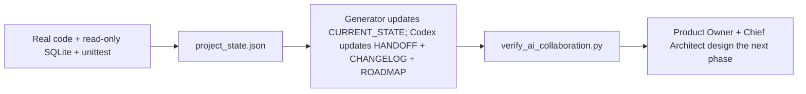

# AI Collaboration

## Sleep Regularity Engine 2.0 handoff

The authoritative implementation is `src/sleep_regularity.py`; the page is a
consumer only. Keep long-term regularity separate from last-night deviation,
preserve null/zero semantics, use circular local-time calculations, and do not
change the existing Sleep card layout when calibrating the algorithm.

## Training baseline decision

The training-day baseline uses only valid training days. Rest days, unsynced
days, missing days, and incomplete records cannot enter a training-day median.
Single-day status and rolling seven-day load are evaluated separately so a
normal rest day is not presented as a training-load failure.

> Operating agreement for the Product Owner, Chief Architect, and Lead Software
> Engineer.
> Effective: 2026-07-10.

## Authority map

Each fact has one primary authority:

| Concern | Primary authority |
| --- | --- |
| Current machine state | [../project_state.json](../project_state.json) |
| Human-readable current state | [CURRENT_STATE.md](CURRENT_STATE.md) |
| Long-term milestones | [ROADMAP.md](ROADMAP.md) |
| Architecture boundaries | [ARCHITECTURE.md](ARCHITECTURE.md) |
| Technical decisions | [DECISIONS.md](DECISIONS.md) |
| Historical changes | [CHANGELOG.md](CHANGELOG.md) |
| Version source | [../config/versions.json](../config/versions.json) |
| Quality gate | [QUALITY_GATE.md](QUALITY_GATE.md) |
| Release records | [../releases/README.md](../releases/README.md) |
| Sync pipeline | [SYNC_PIPELINE.md](SYNC_PIPELINE.md) |
| AI Coach design | [AI_COACH.md](AI_COACH.md) |
| Cloud provider evaluation | [CLOUD_PROVIDER_EVALUATION.md](CLOUD_PROVIDER_EVALUATION.md) |
| Provider due diligence | [PROVIDER_DUE_DILIGENCE.md](PROVIDER_DUE_DILIGENCE.md) |
| AI Coach threat model | [AI_COACH_THREAT_MODEL.md](AI_COACH_THREAT_MODEL.md) |
| AI Coach contract versions | [../config/ai_coach_contract.json](../config/ai_coach_contract.json) |
| AI Coach safety policy | [../config/ai_coach_safety_policy.json](../config/ai_coach_safety_policy.json) |
| AI Coach evaluation policy | [../config/ai_coach_evaluation.json](../config/ai_coach_evaluation.json) |
| AI Coach provider approval | [../config/ai_coach_provider_approval.json](../config/ai_coach_provider_approval.json) |

The current phase handoff is [HANDOFF.md](HANDOFF.md). It is a verified delivery
artifact, not a replacement for any authority above.

Specialist documents own their domain details:

- [DATABASE.md](DATABASE.md) owns schema and migration descriptions.
- [DATA_DICTIONARY.md](DATA_DICTIONARY.md) owns field meaning and units.
- [RECOVERY_ENGINE.md](RECOVERY_ENGINE.md) owns scoring behavior.
- [API.md](API.md) owns external and internal interface contracts.
- [TESTING.md](TESTING.md) owns test policy.
- [VERSIONING.md](VERSIONING.md) owns version semantics.
- [CODING_STANDARD.md](CODING_STANDARD.md) owns implementation standards.
- [SYNC_PIPELINE.md](SYNC_PIPELINE.md) owns pipeline order, resume, history, and operational safety.
- [AI_COACH.md](AI_COACH.md) owns future generative input, output, privacy,
  safety, audit, and approval boundaries.
- [CLOUD_PROVIDER_EVALUATION.md](CLOUD_PROVIDER_EVALUATION.md) owns dated cloud
  provider evidence, eligibility, and compliant unblocking paths.
- [PROVIDER_DUE_DILIGENCE.md](PROVIDER_DUE_DILIGENCE.md) owns provider questions,
  evidence acceptance, contract red lines, and revalidation rules.
- [AI_COACH_THREAT_MODEL.md](AI_COACH_THREAT_MODEL.md) owns AI assets, trust
  boundaries, threat controls, incident response, and residual-risk acceptance.
- [../config/ai_coach_contract.json](../config/ai_coach_contract.json) owns prompt,
  output-schema, safety-policy versions and schema filenames.
- [../config/ai_coach_safety_policy.json](../config/ai_coach_safety_policy.json)
  owns semantic phrase categories and fallback reason codes.
- [../config/ai_coach_evaluation.json](../config/ai_coach_evaluation.json) owns
  local and future-model evaluation thresholds.
- [../config/ai_coach_provider_approval.json](../config/ai_coach_provider_approval.json)
  owns machine authorization state, evidence dates, approvals, and fingerprint.

Other documents should link to these authorities instead of copying large
sections. Historical documents may retain old values when clearly dated.

## User — Product Owner

The User is the Product Owner.

Responsibilities:

- Define requirements and desired outcomes.
- Set priorities and acceptance criteria.
- Perform user-level acceptance testing.
- Make final product and privacy decisions.
- Approve scoring changes and irreversible data operations.
- Decide whether data may leave the local machine.
- Report real-world discrepancies with dates and observable symptoms.
- Keep account credentials private.

The Product Owner never needs to paste a Client Secret, access token, or refresh
token into a collaboration prompt.

## ChatGPT — Chief Architect

ChatGPT acts as Chief Architect.

Responsibilities:

- Architecture.
- Research.
- Algorithms.
- Review.
- Roadmap.
- Define module boundaries and dependency direction.
- Identify data leakage and statistical risks.
- Compare alternatives and record consequential decisions.
- Keep deterministic scoring separate from generative explanation.
- State assumptions and time-sensitive evidence.
- Protect the medical decision-support boundary.

The Chief Architect proposes designs. The Product Owner approves product
trade-offs, and Codex validates implementation feasibility against the repo.

## Codex — Lead Software Engineer

Codex acts as Lead Software Engineer.

Responsibilities:

- Implementation.
- Refactor.
- Bug Fix.
- Testing.
- Migration.
- Inspect existing code before changing it.
- Preserve unrelated user changes.
- Keep edits within the authorized scope.
- Add risk-appropriate tests.
- Run real verification without exposing sensitive data.
- Maintain machine state and affected documentation.
- Report blockers with evidence.

Codex must not infer permission for destructive database operations, secret
disclosure, external publication, or changes outside the requested phase.

## Phase completion gate

Every time Codex completes a phase task, all of the following are mandatory:

1. Run the complete unittest suite.
2. Run `.venv/bin/python scripts/update_project_state.py`.
3. Run state-consistency tests again.
4. Update [CHANGELOG.md](CHANGELOG.md).
5. Update [ROADMAP.md](ROADMAP.md).
6. Update [HANDOFF.md](HANDOFF.md).
7. If the phase forms a formal version, create `releases/VERSION.md`.
8. Self-check against [QUALITY_GATE.md](QUALITY_GATE.md).
9. Record the Gate Result.
10. Hand the result to the User for runtime acceptance.
11. Hand the result to ChatGPT for Architecture Review.

A phase is not complete when tests fail, state validation fails, or required
documentation remains stale.

## Standard handoff summary

Every completed phase handoff must follow the exact executable contract checked
by `scripts/verify_ai_collaboration.py`. It includes, in order: Goal, Status,
Files Changed, Version Changes, Database Migrations, Tests, Current State
Generation, System Status, Release Record, Real Data Verification,
Documentation Updated, State Synchronization, Known Issues, Prioritized Issues,
Quality Gate Result, Architecture Decisions Needed, Manual User Actions
Required, and Recommended Next Phase.

The minimum presentation shape is:

```markdown
Phase / Version
<phase name and relevant app, engine, schema, dashboard, or model versions>

Goal
<phase objective>

Status
<completed, blocked, or other verified state>

Files Changed
<created, modified, and deleted files>

Version Changes
<app, recovery, baseline, database, and dashboard versions>

Database Migrations
<none, or exact migration and compatibility impact>

Tests
<command, total, passed/failed, and relevant focused tests>

Current State Generation
<generation, idempotency, and manual-region preservation>

System Status
<health and reasons>

Release Record
<release file and version>

Real Data Verification
<what real local data was checked without exposing sensitive values>

Documentation Updated
<state, changelog, and specialist documents>

State Synchronization
<project state, current state, changelog, roadmap, handoff, and release status>

Known Issues
<remaining verified limitations>

Prioritized Issues
<priority, status, and ownership>

Quality Gate Result
<PASS, PASS WITH CONDITIONS, or FAIL; conditions and failed checks>

Architecture Decisions Needed
<none, or decisions requiring Product Owner/Chief Architect approval>

Manual User Actions Required
<acceptance actions or none>

Recommended Next Phase
<one scoped next step>
```

Use `None` when a section has no applicable item. Do not omit a heading.

## State update workflow



This is the required closed loop. Structured state supplies facts; Codex records
the completed work; verification rejects drift; the Product Owner and Chief
Architect use the same verified handoff for the next design decision.

The normal sequence is:

1. Implement and run focused tests.
2. Update affected specialist documentation.
3. Update CHANGELOG and ROADMAP.
4. Run `scripts/update_project_state.py`.
5. Let the script discover the test count, execute all tests, read SQLite, inspect
   implemented score versions, and validate CURRENT_STATE.
6. Run state-consistency tests and fix every mismatch.
7. Run the script again and confirm byte-stable generated output.
8. Update [HANDOFF.md](HANDOFF.md) with the standard sections.
9. Create the release snapshot when applicable.
10. Self-check [QUALITY_GATE.md](QUALITY_GATE.md) and record the result.
11. Run `.venv/bin/python scripts/verify_ai_collaboration.py`.
12. Deliver the verified handoff to the User for acceptance and ChatGPT for
    Architecture Review.

Do not manually estimate database counts or test totals.

## Mismatch handling

When a prompt, document, database, and code disagree:

1. Preserve the conflicting evidence.
2. Identify the primary authority for that fact.
3. Verify runtime facts from code, SQLite, and tests.
4. Update stale human documentation.
5. Record a behavior change in CHANGELOG when applicable.
6. Request a Product Owner decision when the conflict is about intent rather
   than observable state.

Never make the machine state agree by inventing counts.

## Architecture workflow

For a proposed feature:

1. Product Owner defines the outcome and constraints.
2. Chief Architect assigns the change to a layer.
3. Consequential choices are recorded in DECISIONS.
4. Codex implements through existing module boundaries.
5. Tests verify behavior and failure paths.
6. Documentation and state are updated.
7. Product Owner performs acceptance testing.

Dashboard code must not call Polar directly. Recovery Engine must not depend on
Streamlit. AI Coach must not calculate or overwrite recovery scores.

## Algorithm workflow

A scoring change requires:

- Explicit input fields and units.
- Missing-data behavior.
- Baseline and outlier behavior.
- Weights and direction.
- Fallback behavior.
- A new Recovery Engine version when semantics change.
- Historical replay or representative fixtures.
- RECOVERY_ENGINE and VERSIONING updates.
- Product Owner approval before becoming the default.

AI-generated wording is not a scoring algorithm.

## Database workflow

A schema change requires:

- Table or column purpose.
- Type, unit, nullability, and default.
- Unique key and index strategy.
- Forward migration.
- Old-data handling.
- Empty and legacy database tests.
- DATABASE, DATA_DICTIONARY, VERSIONING, CURRENT_STATE, and CHANGELOG updates.
- A backup plan for real local data.

No migration is implied by a documentation-only phase.

## Security rules

- Never print or document access tokens.
- Never print or document refresh tokens.
- Never print or document Client Secrets.
- Do not read token files for project status.
- Do not expose raw_json in Dashboard or handoff summaries.
- Use fictional credentials in tests.
- Keep external research free of local personal data.
- Require explicit authority for data export or cloud synchronization.

## Review checklist

Before handoff, verify:

- The requested scope is complete.
- Forbidden modules were not changed.
- Layer boundaries remain intact.
- Null and zero retain distinct meaning.
- Units and dates are explicit.
- Repeated execution is safe where required.
- Tests cover the behavior and error path.
- Runtime state matches project_state.json.
- Human state matches machine state.
- No sensitive field appears in state or logs.
- The handoff follows the standard template.
