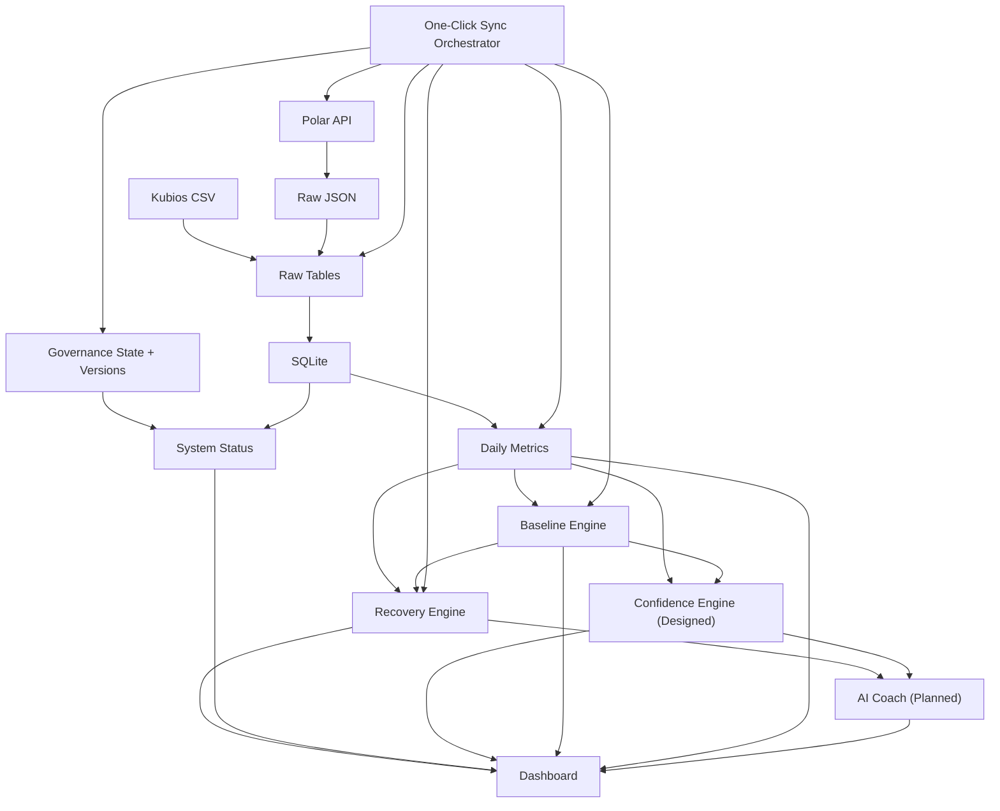

# Architecture

## Sleep Regularity Engine 2.0 boundary (2026-07-22)

`src.sleep_regularity.SleepRegularityService` owns canonical sleep validation,
deduplication, maturity/confidence, circular clock statistics, SRI selection,
summary fallback, and last-night schedule deviation. `src.sleep_adapters` is
the source adapter boundary for Polar and future HealthKit records. The Sleep
page reads the result and preserves the existing five-card layout; it does not
implement scoring logic.

## Training Load & Habits baseline (2026-07-22)

`src.training_baseline` is the read-only service boundary for the Training
dashboard's status model and personal training-load projections. It reads
`polar_training_sessions_raw`, uses `daily_recovery_metrics` only to identify
known synchronized dates, and reads canonical pipeline status from
`data/sync_history.db`. Missing, unsynced, incomplete, rest, no-training, and
real-zero values remain distinct. Typical training-day baselines use only
metric-valid training dates; rolling seven-day load is evaluated separately.

## Structured training boundary

The Training page calls `training_logging` services and executes no SQL. The
service resolves objective fields from `polar_training_sessions_raw`, while
manual tables store only the normalized session index, sport override, exercises
and sets. Exact external ID is the automatic link; date proximity is never an
unprompted merge rule.

Training-detail summaries are read-only future analysis inputs. Recovery,
Baseline, Confidence, Daily Metrics and Polar fetch/import modules do not import
or depend on `training_logging`.

The presentation-only `src/ui/components/training_entry.py` owns entry mode,
effort preference, catalog-default, and conditional-field rules. It performs no
SQL and no summary calculation. Dashboard renders the rules and delegates
validated writes to `training_logging`; hidden fields stay in editor state.

## Simple nutrition boundary

The Nutrition page renders food-level rows and calls `nutrition_logging`
services; it executes no SQL. Unit validation, catalog lookup, multi-tag
classification, reliable conversion, summaries, recent foods, copies, templates
and AI-safe projection remain in service modules. Supplements reuse their
existing catalog and dynamic-unit table. Recovery, Baseline, Confidence, Polar
and cloud-AI runtimes do not depend on this path.

## Supplement unit boundary

The Nutrition page calls `nutrition_logging` services and never writes SQL.
Unit codes, catalog policy, validation, grouping and AI-safe projection live in
that package. Recovery, Baseline and Confidence engines do not consume this model.

## Domain-first App information architecture

The Streamlit presentation layer is organized into Training, Sleep, Recovery,
Nutrition, My, and Settings. Domain display pages consume read-only projections
from `domain_dashboard_data.py`; explicit local input pages delegate writes to
their repository/service layer instead of executing SQL. The former Kubios
import/advanced pages are not linked at the top level, but their modules and
records remain intact. Polar V4 sleep dates are expanded
through one-day feature requests; nested sleep evaluation fields and sleep-window
continuous heart-rate aggregates feed the read-only Sleep projection. Truly
absent upstream values remain unavailable and are never inferred.

## Kubios HRV three-layer boundary

Reviewed CSV, screenshot, and manual records enter `kubios_hrv_measurements_raw`.
The normalization builder selects one daily primary record using explicit review
and configured priority, and `kubios_hrv_derived` adds deterministic trends and
baseline comparisons. Dashboard, report, and AI Context consume only read-only
projections. Recovery, Confidence, and Local Coach retain their existing inputs
and formulas. Confirmed complementary screenshots may merge non-null fields only;
raw records remain immutable audit evidence.

## Kubios Screenshot Boundary

`src/pages/2_Kubios_Screenshot_Import.py` only orchestrates UI state. System OCR
is isolated behind `src/kubios_screenshot/ocr_adapter.py`; preprocessing,
parsing, confidence, review, storage and audit are independently testable.
Confirmed import delegates to the existing `src/kubios_import.py` raw writer
and daily-metric source selection. No screenshot module imports a cloud AI or
network client. Dashboard status queries use the migrated schema read-only.

## Internationalization display layer

`src/i18n/` is a presentation-side service consumed by Dashboard, Daily Log,
recovery explanation rendering, report rendering, and AI Context rendering.
It may read locale resources and the non-health language preference, but it may
not write health tables, call Polar or network services, or enter Recovery,
Baseline, Confidence, or Local Coach calculation dependencies. Stable internal
codes flow into the display layer and are translated only at render time.

## Local Coach and Cloud AI boundary

Personal Logging adds `User Input → SQLite → Daily Summary → AI Context
Projection → Manual Review → Manual Upload`. Projection reads allowlisted
aggregates, never raw Polar JSON or token files. Automatic upload remains prohibited.

The released local path is `Deterministic Data → Recovery Engine → Confidence
Engine → Deterministic Explanation → Local Coach → Dashboard / Report`.
Local Coach is read-only toward upstream results and owns only its recommendation
table. The separate cloud path remains `Provider Approval → Provider Adapter →
Exact-Model Evaluation → Cloud Runtime`. It is blocked. Local schema `0.4.0`
does not satisfy the future Cloud AI audit requirement.

> System boundaries and dependency direction.
> Verified: 2026-07-10

## 系统总图

- 主数据流如下，箭头表示允许的主方向。

- Polar API 是外部事实来源。
- Raw JSON 是网络响应的不可解释存档。
- Raw Tables 提供可去重的结构化来源层。
- SQLite 是当前本地事实存储。
- Daily Metrics 是日粒度分析契约。
- Baseline Engine 只比较个人历史。
- Recovery Engine 计算确定性评分。
- Confidence Engine 未来独立计算数据可靠程度，不修改评分。
- AI Coach 未来只解释与建议。
- Dashboard 是只读展示消费者。

## 分层规则

- 层 0 是外部来源与本地导入文件。
- 层 1 是客户端、OAuth 和抓取编排。
- 层 2 是 raw 文件与 raw 数据库表。
- 层 3 是日粒度标准化指标。
- 层 4 是个人滚动基线。
- 层 5 是 Recovery Engine。
- 层 6 是解释、日报和未来 AI Coach。
- 层 7 是 Dashboard 或未来客户端。
- 调用通常只能指向同层基础设施或下一层输入。
- 展示层不得反向调用外部数据源。
- 算法层不得导入 Streamlit。
- 客户端层不得导入评分模块。
- raw 层不得依赖派生表。
- 迁移与 schema 只能由数据库模块管理。
- 跨层需求必须先定义稳定数据契约。

## Polar OAuth

- 位置：src/polar_oauth.py。
- 职责：完成授权码流程并安全保存 token。
- 主要输入：Polar 授权服务器。
- 主要输出：token 文件。
- 禁止事项：不能执行数据分析。

## Polar Client

- 位置：src/polar_client.py。
- 职责：封装 v3/v4 请求和 token refresh。
- 主要输入：token 文件与 Polar API。
- 主要输出：Python 对象或安全错误。
- 禁止事项：不能写分析表。

## Polar Fetch

- 位置：src/polar_fetch.py。
- 职责：编排抓取并保存 raw JSON。
- 主要输入：Polar Client。
- 主要输出：data/raw/*.json。
- 禁止事项：不能计算日指标。

## Polar Import

- 位置：src/polar_import.py。
- 职责：解析 raw JSON 并 upsert raw 表。
- 主要输入：data/raw/*.json。
- 主要输出：polar_*_raw。
- 禁止事项：不能直接调用 Polar API。

## Flow Collector

- 位置：src/polar_flow_collect.py。
- 职责：收集 Polar Flow 导出文件并按摘要去重。
- 主要输入：本地导出目录。
- 主要输出：polar_flow_import_files。
- 禁止事项：不能假定已解析内容。

## Kubios Import

- 位置：src/kubios_import.py。
- 职责：解析晨测 CSV 并同步日字段。
- 主要输入：data/imports CSV。
- 主要输出：kubios raw 与 daily metrics。
- 禁止事项：不能访问 Kubios 账号。

## Database

- 位置：src/db.py。
- 职责：连接、建表和有限迁移。
- 主要输入：SQLite 路径。
- 主要输出：sqlite3 connection。
- 禁止事项：不能包含评分公式。
- Schema migration ledger 属于治理元数据，与健康业务表分离。
- 只有写侧 `db.connect/init_db` 可执行或登记迁移。
- Dashboard Data 使用 SQLite `mode=ro`，不得触发 init_db 或 migration。

## Daily Metrics

- 位置：src/daily_metrics.py。
- 职责：按日期汇总活动、训练、睡眠和夜间恢复。
- 主要输入：raw 表。
- 主要输出：daily_recovery_metrics。
- 禁止事项：不能读取 Dashboard 状态。

## Baseline Engine

- 位置：src/baseline.py。
- 职责：计算排除当天的个人滚动统计。
- 主要输入：daily_recovery_metrics 与 config。
- 主要输出：baseline_metrics。
- 禁止事项：不能生成训练建议。

## Recovery Engine

- 位置：src/recovery_score.py。
- 职责：计算版本化评分和建议。
- 主要输入：daily metrics 与 baselines。
- 主要输出：recovery_scores。
- 禁止事项：不能依赖 Streamlit。

## Confidence Engine — Implemented

- 位置：`src/recovery_confidence.py`。
- 职责：计算 Data Completeness、Baseline Maturity 和 Confidence。
- 主要输入：daily metrics 与 baselines。
- 主要输出：独立、版本化的 `recovery_confidence` 结果。
- 禁止事项：不能修改 recovery_scores 或 recommendation。
- 设计契约：[CONFIDENCE_ENGINE.md](CONFIDENCE_ENGINE.md)。

## Explanation

- 位置：src/recovery_explain.py。
- 职责：把基线偏离解释为有利、压力或缺口。
- 主要输入：评分与 baseline 查询结果。
- 主要输出：只读解释对象。
- 禁止事项：不能重算评分。

## Report

- 位置：src/report.py。
- 职责：生成指定日期中文 Markdown。
- 主要输入：daily metrics 与 scores。
- 主要输出：reports/*.md。
- 禁止事项：不能访问外部 API。

## Dashboard Data

- 位置：src/dashboard_data.py。
- 职责：封装只读 SQLite 查询和 duration 转换。
- 主要输入：SQLite。
- 主要输出：展示友好字典。
- 禁止事项：不能写数据库。

## Dashboard

- 位置：src/dashboard.py。
- 职责：渲染状态、趋势、基线和解释。
- 主要输入：Dashboard Data。
- 主要输出：本地 Streamlit UI。
- 禁止事项：不能直接访问 Polar API。

## System Status

- 位置：src/system_status.py。
- 职责：读取治理状态、统一版本和数据库可读性并判定系统健康。
- 主要输入：project_state.json、config/versions.json、Dashboard Data 只读查询层。
- 主要输出：Dashboard 友好状态字典和 Healthy/Warning/Unhealthy 判定。
- 禁止事项：不能运行 unittest、读取凭据、写数据库或调用外部 API。

## One-Click Sync Pipeline

- 入口：src/sync_pipeline.py。
- 步骤模块：src/pipeline/。
- 职责：按顺序调用现有 token、fetch、import、metrics、baseline、recovery、report 和 governance 契约。
- 运行状态：独立的 data/sync_history.db 和 logs/sync.log。
- 禁止事项：不能实现 OAuth/API 替代路径、复制评分公式、改变业务 schema 或调用 AI。
- Dashboard 只读取最新同步摘要，不由 pipeline 启动或修改分析结果。
- Fetch adapter converts the existing raw-save result into required failure,
  optional warning, or success without changing PolarClient request behavior.
- Pipeline errors cross layer boundaries only as safe codes and allowlisted text.
- Finalization owns the last history write and converts storage failure into a
  controlled pipeline result.
- 详细契约：[SYNC_PIPELINE.md](SYNC_PIPELINE.md)。

## AI Coach

- 状态：架构与安全契约已设计，运行模块尚未实现。
- 本地契约：`src/ai_coach_contract.py` 纯验证输入/输出；无网络、数据库或 provider 依赖。
- 本地安全：`src/ai_coach_safety.py` 验证 evidence、Confidence、医疗边界和紧急升级，并生成确定性 fallback。
- 本地预检：`src/ai_coach_evaluation.py` 生成合成案例并只输出聚合安全结果。
- 本地授权：`src/ai_coach_approval.py` 在序列化前验证 provider evidence、双审批、有效期、HTTPS endpoint 和 fingerprint。
- 本地上下文：`src/ai_coach_context.py` 显式投影 approved fields、注入 contract versions，并在构建前检查机器授权。
- 本地就绪门：`src/ai_coach_readiness.py` 聚合 contract/safety/preflight/approval/model/migration/adapter/model-eval 状态。
- 位置：未来只读 sidecar，位于 Recovery 与 Confidence 的下游。
- 职责：通过最小化 allowlist context 提供解释、限制、可审阅选项和问题。
- 主要输入：持久化评分、置信度、聚合指标、基线比较和用户问题。
- 主要输出：版本化 schema 与 audit envelope；失败时降级到确定性解释。
- 禁止事项：不能负责基础评分、写业务表、读取 token/raw JSON、调用工具或在未批准前传输数据。
- 详细契约：[AI_COACH.md](AI_COACH.md)。
- 隐私与安全威胁：[AI_COACH_THREAT_MODEL.md](AI_COACH_THREAT_MODEL.md)。

## 允许调用矩阵

- polar_oauth → Polar 授权端点：允许。
- polar_client → Polar API：允许。
- polar_fetch → polar_client：允许。
- polar_fetch → data/raw：允许。
- polar_import → data/raw：允许。
- polar_import → db connection：允许。
- kubios_import → CSV：允许。
- kubios_import → db connection：允许。
- daily_metrics → raw 表：允许。
- baseline → daily_recovery_metrics：允许。
- recovery_score → daily_recovery_metrics：允许。
- recovery_score → baseline_metrics：允许。
- report → daily_recovery_metrics：允许。
- report → recovery_scores：允许。
- dashboard_data → SQLite：允许且只读。
- dashboard → dashboard_data：允许。
- dashboard → recovery_explain：允许且纯函数。
- dashboard → system_status：允许且只读。
- system_status → dashboard_data：允许且只读。
- sync_pipeline → pipeline steps：允许。
- pipeline fetch → polar_fetch / polar_client：允许复用现有请求契约。
- pipeline importer → polar_import / kubios_import：允许复用现有导入契约。
- pipeline metrics → daily_metrics：允许。
- pipeline baseline → baseline：允许且不得定义计算规则。
- pipeline recovery → recovery_score build/upsert：允许且不得定义公式。
- pipeline report → report：允许。
- pipeline governance → state generator：允许。
- pipeline → Dashboard：禁止写入或启动；Dashboard 自行读取更新结果。
- dashboard → Polar API：禁止。
- recovery_score → dashboard：禁止。
- baseline → OAuth：禁止。
- AI Coach → token 文件：禁止。
- AI Coach contract validator → config JSON Schema：允许且只读。
- AI Coach contract validator → network/database：禁止。
- AI Coach safety → contract validator/config：允许且只读。
- AI Coach safety → provider/network/database：禁止。
- AI Coach evaluation → contract/safety：允许。
- AI Coach evaluation → provider/network/database/real data：禁止。
- AI Coach approval → provider approval config/contract versions：允许且只读。
- AI Coach approval → provider/network/database/secret：禁止。
- AI Coach context → approval/contract：允许。
- AI Coach context → provider/network/database/raw/engine：禁止。
- AI Coach readiness → config/local safety gates/artifact existence：允许且只读。
- AI Coach readiness → provider/network/database/real data：禁止。
- AI Coach → recovery_scores：未来只读允许。
- AI Coach → recovery_confidence：未来只读允许。
- AI Coach → raw 表/raw_json：禁止。
- AI Coach → 外部 provider：未经单独隐私批准禁止。
- AI Coach → 更新 recovery_score：禁止。
- raw 导入 → 删除历史评分：禁止。

## 数据契约

- 外部日期统一为 YYYY-MM-DD 后进入分析层。
- 时间戳保留原始时区信息时不得擅自丢失。
- duration raw 字段可保留 ISO 8601。
- Baseline Engine 会把 duration 转成配置指定单位。
- daily_recovery_metrics 每个 date 唯一。
- recovery_scores 每个 date 唯一。
- baseline_metrics 以 date、metric_name、window_days 唯一。
- raw 表以 source、external_id、date 去重。
- raw_json 保存来源完整对象用于追溯。
- 派生字段不得反向覆盖 raw_json。
- 缺失数值使用 NULL。
- 真实零值与 NULL 必须区分。
- score_version 与评分同写。
- created_at 表示首次写入。
- updated_at 表示最近 upsert。

## 失败与恢复

- OAuth 失败停留在授权层。
- Token refresh 失败不得继续发送无效请求。
- 单个 Polar 端点失败可以保存安全错误摘要。
- 抓取失败不应删除上次成功 raw 文件。
- 导入任务采用 upsert 支持重跑。
- 日指标重建采用 date upsert。
- 基线批量重算采用组合唯一键 upsert。
- 评分重建采用 date upsert。
- Dashboard 遇到缺表应返回空状态。
- Dashboard 遇到 NULL 应显示暂无数据。
- 报告遇到无日期数据应给出明确错误。
- SQLite 写入应在模块边界内 commit。
- 批量流程失败后可从最近稳定层重跑。
- 任何恢复操作都不得默认删除原始数据。

## 演进规则

- 新增数据源必须先定义 raw 存储。
- 新增日指标必须更新数据库和数据字典。
- 新增 baseline 指标必须更新 config。
- 新增评分版本必须更新 score_version。
- 新增 Dashboard 图表必须从查询辅助层取数。
- 新增 AI 功能必须定义输入与输出 schema。
- 新增云服务必须进行隐私评审。
- 新增表必须定义唯一性和迁移策略。
- 移除字段前必须检查历史报告与查询。
- 跨模块重构必须避免循环引用。
- 架构图在层级变化后立即更新。
- 架构决策在 DECISIONS.md 留痕。

## Governance Control Plane

- `scripts/update_project_state.py` reads implemented versions, read-only
  SQLite counts, and the complete unittest result.
- `project_state.json` is the machine-readable runtime authority.
- `docs/CURRENT_STATE.md` is the validated human-readable mirror.
- `docs/HANDOFF.md` is the current phase delivery artifact.
- `scripts/verify_ai_collaboration.py` checks state freshness, handoff structure,
  authority files, and prohibited imports.
- `scripts/finalize_phase.py` refreshes state and runs all governance checks.
- Governance scripts may inspect source imports but do not call Polar APIs.
- Governance scripts may read SQLite in read-only mode but do not write it.
- Governance tooling sits beside the product pipeline and cannot change
  Recovery Engine output.

## Scheduled sync and manual source architecture

- LaunchAgent invokes `scripts/run_scheduled_sync.py`, which delegates to the
  same `PipelineRunner` used by manual sync.
- `PipelineRunner` owns the cross-process lock and writes `trigger_type` to the
  independent sync history database.
- Manual CRUD writes only through `src/manual_logging`; Streamlit passes
  `migrate=False`, so pages never apply schema migrations.
- `src/data_resolution` owns per-field policies and provenance. Dashboard,
  Report, and AI Context consume its results; no page owns priority logic.
- `resolved_daily_fields` is derived and recomputable. Polar/Kubios raw tables
  and deterministic Recovery/Baseline/Confidence/Local Coach inputs remain
  unchanged.
# Brand-based supplement boundary

`src/supplements/` owns product/ingredient validation, repository operations and
deterministic serving multiplication. `src/supplements/enrichment/` owns only
candidate contracts and an approval-gated provider interface. Nutrition storage
owns meal/intake transactions and writes a legacy compatibility row. AI Context
reads the safe projection; health engines and Polar remain downstream-isolated.
